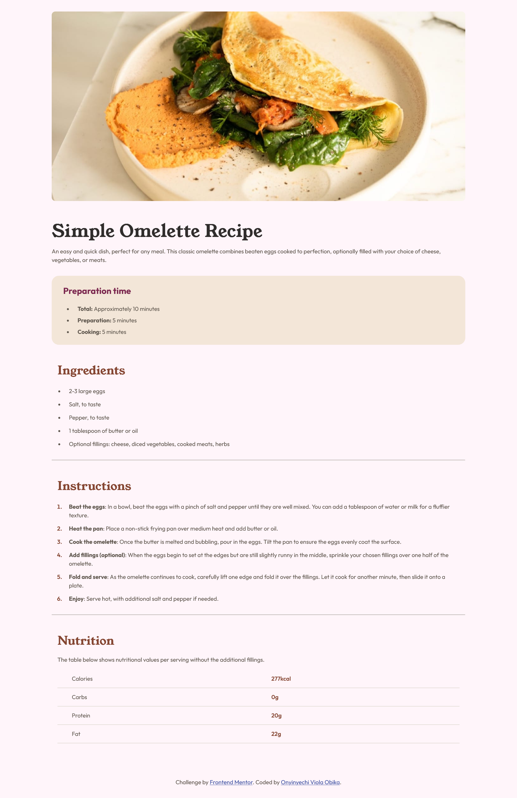

# Frontend Mentor - Recipe page solution

This is a solution to the [Recipe page challenge on Frontend Mentor](https://www.frontendmentor.io/challenges/recipe-page-KiTsR8QQKm). Frontend Mentor challenges help you improve your coding skills by building realistic projects. 

## Table of contents

- [Overview](#overview)
  - [The challenge](#the-challenge)
  - [Screenshot](#screenshot)
  - [Links](#links)
- [My process](#my-process)
  - [Built with](#built-with)
  - [What I learned](#what-i-learned)
  - [Continued development](#continued-development)
- [Author](#author)

## Overview

### Screenshot

**Desktop Preview**




### Links

- Solution URL: [Add solution URL here](https://your-solution-url.com)
- Live Site URL: [Add live site URL here](https://your-live-site-url.com)

## My process

### Built with

- Semantic HTML5 markup
- CSS custom properties
- Mobile-first workflow


### What I learned

I learned how to make a table layout and style it.

```html
<table class="nutritional__content">
        <tbody>
          <tr>
            <td>Calories</td>
            <td class="nutrition__list--amount">277kcal</td>
          </tr>

          <tr>
            <td>Carbs</td>
            <td class="nutrition__list--amount">0g</td>
          </tr>

          <tr>
            <td>Protein</td>
            <td class="nutrition__list--amount">20g</td>
          </tr>

          <tr>
            <td>Fat</td>
            <td class="nutrition__list--amount">22g</td>
          </tr>

        </tbody>
      </table>
```

```css
.nutritional__content {
    width: 100%;
    border-collapse: collapse;
}
```
This is how I was able to style the table. With the *border-collapse* property I was able to join adjacent table data borders together. This was how I was able to get the border-bottom of the table data to join together like in the preview.

### Continued development

I will be looking into learning more about tables even though most developers rarely use it nowadays, I think they are still useful.

## Author

- Hashnode Blog - [Onyinyechi Viola Obika](https://obikaviola.hashnode.dev/)
- Frontend Mentor - [@Obikaviola](https://www.frontendmentor.io/profile/Obikaviola)
- LinkedIn - [Onyinyechi Obika](https://www.linkedin.com/in/onyinyechi-obika)
- X - [@obika_viola](https://x.com/obika_viola)